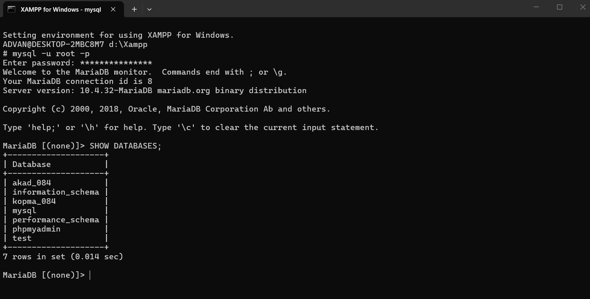
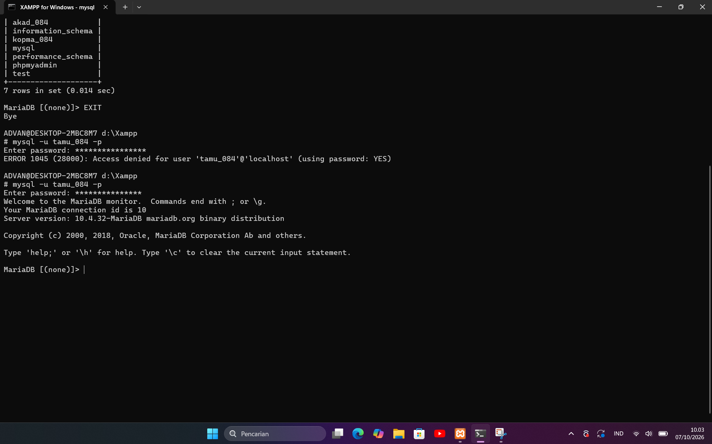
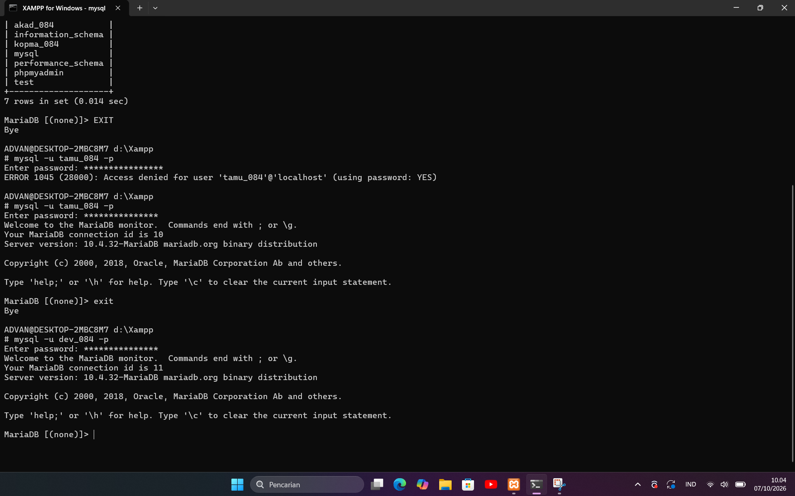
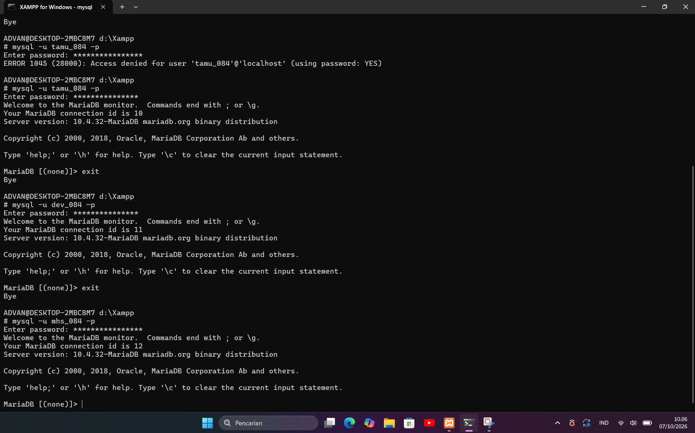

# Laporan Praktikum Basis Data
**Nama:** Richo Sayu Rahmadani  
**NIM:** 25430084  
**Kelas:** C  
**Tanggal:** 4 Oktober 2026  

## 1. Tujuan Praktikum
(Tulis ulang tujuan praktikum Modul 1 dengan bahasa sendiri, maksimal 5 baris, yang mencakup pemahaman layanan MariaDB, penggunaan CLI dan phpMyAdmin, pengamanan akun, serta inisialisasi repositori Git).

## 2. Ringkasan Dasar Teori
(Tuliskan pemahaman sendiri mengenai arsitektur klien-server MariaDB, peran XAMPP, perbedaan CLI dan phpMyAdmin, serta pentingnya prinsip hak akses minimum/least privilege, maksimal setengah halaman tanpa menyalin langsung dari buku).

## 3. Hasil Langkah Percobaan
(Sertakan tangkapan layar langkah-langkah kunci Modul 1 sesuai checklist khusus, masing-masing diberikan keterangan singkat):
- Status layanan MariaDB di XAMPP Control Panel (Port 3306 berjalan)[cite: 33].
- Hasil kueri `SELECT VERSION(), CURRENT_USER();` dan `SELECT @@sql_mode;` pada CLI[cite: 34].
- Pengujian hak akses `SHOW DATABASES;` sebagai `mhs_123` serta pembuktian penolakan galat (misal ERROR 1044/1142)[cite: 35].
- Tampilan halaman masuk phpMyAdmin menggunakan mode *cookie*[cite: 36].
- Bukti perintah `git push` pertama ke repositori GitHub[cite: 37].

## 4. Jawaban Titik Analisis
- **Titik Analisis 1:** (Jawaban mengenai konsekuensi label "MySQL" di XAMPP padahal yang berjalan adalah MariaDB)[cite: 33].
- **Titik Analisis 2:** (Analisis pesan galat ketika masuk sebagai `root` tanpa opsi `-p` setelah diberi password)[cite: 34].
- **Titik Analisis 3:** (Penjelasan mengapa `information_schema` tetap terlihat oleh akun kerja sedangkan akses ke `mysql` ditolak dengan ERROR 1044)[cite: 35].
- **Titik Analisis 4:** (Alasan mode *cookie* di phpMyAdmin lebih aman dibanding mode *config*)[cite: 36].

## 5. Hasil Latihan dan Modifikasi
- (Penjelasan dan tangkapan layar hasil pembuatan akun tamu beserta uji coba galat saat mencoba `CREATE TABLE`)[cite: 25, 37].
- (Penjelasan modifikasi skrip `p01_lingkungan_25430084.sql` agar dapat dijalankan berulang kali tanpa galat menggunakan `IF NOT EXISTS`)[cite: 25, 37].

## 6. Tugas Mandiri: Milestone Proyek 1

Pada tugas mandiri modul 1 ini, dilakukan pembuatan basis data proyek, pembuatan akun pengembang (`dev_084`) dengan hak akses terbatas, serta pengujian koneksi dan hak akses menggunakan command line MariaDB.

### Bukti Tangkapan Layar Pelaksanaan Tugas Mandiri:

1. **Pemeriksaan Basis Data yang Tersedia (`SHOW DATABASES;`)**
   
   *Keterangan:* Menampilkan daftar basis data yang ada di server, termasuk basis data praktik (`kopma_084`) dan basis data proyek (`akad_084`) yang dibuat berdasarkan dua digit terakhir NIM (084).

2. **Uji Coba Akses Akun Tamu / Validasi Autentikasi**
   
   *Keterangan:* Pengujian masuk ke server MariaDB menggunakan akun `tamu_084`. Terlihat pesan galat `ERROR 1045 (28000): Access denied` ketika salah memasukkan password, dan berhasil masuk setelah kredensial yang dimasukkan benar.

3. **Uji Coba Masuk dengan Akun Pengembang (`dev_084`)**
   
   *Keterangan:* Berhasil masuk ke monitor MariaDB menggunakan akun pengembang proyek (`dev_084`) dengan password yang sesuai, menandakan akun siap digunakan untuk pengembangan basis data proyek.

4. **Uji Coba Masuk dengan Akun Praktik (`mhs_084`)**
   
   *Keterangan:* Memastikan akun praktik harian (`mhs_084`) dapat terhubung dengan baik ke server MariaDB setelah proses konfigurasi keamanan akun *root* dan pembuatan akun kerja selesai.

---

## 7. Pembahasan dan Kendala
Selama pelaksanaan praktikum Modul 1, terdapat beberapa kendala dan penyesuaian yang dihadapi, di antaranya:
* **Konfigurasi Akun dan Host:** Saat mengamankan akun `root`, terkadang koneksi ditolak apabila lupa menyertakan opsi `-p` setelah password ditetapkan. Hal ini dapat diatasi dengan memahami struktur pesan galat `ERROR 1045` yang menunjukkan bahwa klien tidak mengirimkan password dengan benar[cite: 34, 38, 39].
* **Perizinan Hak Akses Basis Data:** Saat menguji akun kerja (`mhs_084`) dan akun pengembang (`dev_084`), perintah `SHOW DATABASES` hanya menampilkan basis data yang diizinkan untuk diakses, sedangkan akses ke basis data sistem seperti `mysql` ditolak dengan `ERROR 1044`[cite: 35]. Hal ini membuktikan bahwa prinsip hak akses minimum (*least privilege*) berjalan dengan baik di server MariaDB.
* **Inisialisasi Git:** Penyesuaian konfigurasi identitas global Git (`user.name` dan `user.email`) diperlukan sebelum melakukan proses *commit* dan *push* pertama ke repositori GitHub agar riwayat kontribusi tercatat atas nama mahasiswa yang bersangkutan[cite: 19, 21].

## 8. Kesimpulan
1. Layanan MariaDB melalui XAMPP Control Panel berhasil dijalankan pada port 3306, dan komunikasi dengan server dapat dilakukan secara bergantian menggunakan klien baris perintah (CLI) maupun penjelajah web phpMyAdmin[cite: 29, 30, 33].
2. Keamanan basis data berhasil ditingkatkan dengan memberikan password pada akun `root` serta menerapkan akun kerja dan pengembang dengan hak akses terbatas hanya pada basis data masing-masing[cite: 6, 7, 32].
3. Seluruh rangkaian aktivitas praktikum dan berkas konfigurasi berhasil dicatat serta diunggah secara bertahap ke repositori GitHub pribadi menggunakan kendali versi Git[cite: 32, 36, 37].

## 9. Pernyataan Penggunaan AI
Menggunakan bantuan AI (Gemini) untuk membantu menjelaskan rincian pesan galat (*error handling*) MariaDB, membandingkan sintaks perintah SQL, serta membantu merapikan format penulisan laporan praktikum ke dalam bentuk Markdown[cite: 16].

## 10. Bukti Git
- **Tautan Repositori:** [https://github.com/richosayu07-cmd/basisdata-25430084](https://github.com/richosayu07-cmd/basisdata-25430084)[cite: 15, 25]
- **Hash Commit:** `[06dd84c/p01_lingkungan_25430084.md]`

## 11. Checklist

| Butir | Yang Harus Ada | Status |
| :--- | :--- | :---: |
| Identitas | Nama, NIM, kelas, pertemuan ke-1, tanggal pelaksanaan | ✔️ |
| Tujuan | Tujuan praktikum ditulis ulang dengan bahasa sendiri | ✔️ |
| Ringkasan Teori | Pemahaman sendiri atas Dasar Teori | ✔️ |
| Langkah | Tangkapan layar hasil langkah kunci + keterangan | ✔️ |
| Titik Analisis | Semua Titik Analisis dijawab lengkap dengan alasan | ✔️ |
| Latihan | Skrip/dokumen hasil latihan beserta bukti berjalan | ✔️ |
| Tugas Mandiri | Milestone proyek pertemuan ini: berkas, bukti, dan penjelasan | ✔️ |
| Pembahasan & Kendala | Galat yang ditemui, cara membaca, dan cara mengatasinya | ✔️ |
| Kesimpulan | Dua sampai empat kalimat dengan bahasa sendiri | ✔️ |
| Pernyataan Penggunaan AI | Alat yang dipakai, untuk apa, bagian mana | ✔️ |
| Bukti Git | Tautan repositori dan kode commit (hash) | ✔️ |
| Keaslian | Tangkapan layar menampilkan akun ber-NIM dan jam sistem | ✔️ |

## 12. Checklist Khusus Laporan Pertemuan 1

| Check | Jenis | Yang Harus Ada | Status |
| :---: | :--- | :--- | :---: |
|**Berkas wajib** | `p01_lingkungan_25430096.sql` (dapat dijalankan ulang), `README.md` berisi Identitas Proyek, `.gitignore` | ✔ |Terpenuhi |
|**Bukti tangkapan layar** | `SELECT VERSION(), CURRENT_USER();`, `SELECT @@sql_mode;`, `SHOW DATABASES` sebagai `mhs_096` dan `dev_096`; galat 1044 dan 1142; halaman masuk phpMyAdmin mode `cookie`; `git push` pertama | ✔ | Terpenuhi |
|**Analisis wajib** | Titik Analisis 1–4; perbedaan kode galat 1044, 1045, dan 1142 | ✔ | Terpenuhi |

---